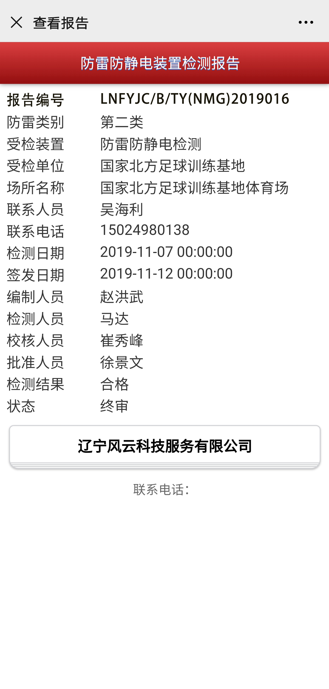

<!DOCTYPE html>
<html lang="zh-cn">

<head>
	<meta charset="utf-8">
	<title>HTML练习</title>
 
</head>
<body bgcolor="#faebd7">
<h1 align="center">
	标题
</h1>
	
空行

	
<u><b>下行</b></u>

	<strong>jiachu</strong>
	xiabiao;sahngbiao
	<mark>biaoji</mark>
	<a href="https://www.baidu.com" target="_blank">超链接百度</a>
	<a href="mailto:823752165@qq.com">lianxiyouxiang</a>
	<a href="#1">456</a>
	<a id="1">516513
</body>
</html>
